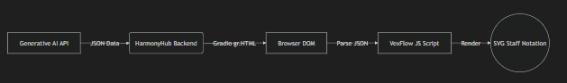

# HarmonyHub: Western Notation Rendering Extension

**Author:** Georges Abi Chahine  
**Date:** March 5, 2026  
**Issue:** #1 - JSON to Western Staff Notation rendering in the browser

**Github Repo Link**: https://github.com/GeorgesAbiChahine/HarmonyHub 

## 0. Try it out for yourself
1. Go to the github repository.
2. Go to the folder "georges_application".
3. Right click "index.html".
4. Click on "Open Preview".
5. Write a structured JSON.
6. Click on the Render Button.

## 1. Approach

The objective is to convert HarmonyHub's generative AI structured JSON output into standard Western staff notation. The JSON output currently represents musical events as pairs of pitches and durations (e.g., `["C4", 2]` or `{"note": "C4", "duration": 2}`). The duration unit corresponds to an 8th note.

To bridge the gap between this structural data and musical notation, the approach is to:

1. **Parse & Normalize:** Read the JSON array and standardize the pitch/duration pairs.
2. **Quantize & Map:** Map numerical durations to VexFlow duration tokens (e.g., `1 -> '8'`, `2 -> 'q'`, `4 -> 'h'`). String pitches need to be transformed to VexFlow keys (e.g., `C4 -> c/4`).
3. **Measure Grouping:** Use the time signature to group individual notes into measures mathematically to prevent rendering overflow.
4. **Render:** Pass the formatted data to VexFlow's API drawing standard SVG elements directly in the browser DOM.

## 2. Implementation

The implementation relies on **VexFlow**, a robust, industry-standard JavaScript engraving library. Since HarmonyHub uses Gradio to serve its web interface, the optimal integration point is generating custom HTML encapsulating the JSON payload and VexFlow logic, which can be rendered using the `gr.HTML()` component.

**System Architecture diagram:**

_Note: If your viewer doesn't support Mermaid natively, here is the rendered [SVG Diagram](https://mermaid.live/edit#pako:eNpFkctuwjAQRX_FmhWVQhSaBySLSoS0QFUeahCL1l24iRMiiI0Gp0CBf68TaOuVZ3zP3GvNCRKZcggg28h9smKoyCKigujTf6cw5IIjU8UXJ_0x6c_HFD5Iu_1wpvAcz6YkYopROJOwRWHEsJTiOKo-SciSNRcphbvrqPDGDJGlhSQ5mqPF5KUGB9okRLnfcSTRbKLHX4nBjZgz3HFSe9XqSKuX_PCks-oeiRMstuqPiW7Mq7bmWOsfWzpXvBySWLEsI1Op9F-k0LmaYGBAjkUKgcKKG1ByLFldwql-paBWvOQUAn1NGa4pUHHRzJaJNynLXwxlla8gyNhmp6tqmzLFo4LlyP4lTaKBrISCwHacZgYEJzjo0vVNz3Jtx_O6vtfrugYcIeh0TNeyLLvb8e17v2c7FwO-G1PLbDQ8LZTEyXV5zQ4vPx9ni60)_

To see the prototype code, check out `index.html` in this directory.

## 3. Challenges

- **Rhythmic Complexities:** Mapping arbitrary 8th-note multiples to precise notation can be ambiguous. Odd lengths like `3` require dotted notes (e.g., dotted quarter `qd`), while lengths like `5` require tied notes across beats.
- **Enharmonic Ambiguity:** A pitch might be generated as sequentially random accidentals, leading to visual clutter. The system needs to infer or be told a key signature to decide between rendering a `D#` or an `Eb`.
- **Rest Representation:** Currently, it's ambiguous how musical rests are stored in the JSON. The parser must gracefully replace blank pitches with VexFlow rest tokens (e.g., `qr`).
- **Auto-Beaming:** VexFlow does not auto-beam 8th notes by default; beam groupings must be explicitly calculated based on the pulse of the time signature.

## 4. Objectives

If developed further, the primary objective is to make the tool a robust pedagogical companion capable of handling fully polyphonic, multi-staff exercises (e.g., grand staff for piano).

- **Target Users:** Music students wanting to practice sight-reading and teachers creating dynamic assignment material.
- **Scope Supported:** Extending past simple pitches to include dynamic markings (p, f), articulations (staccato, slurs), and multiple clefs.
- **User Value:** Translates raw numerical evaluation tools into standard musical literacy.

## 5. Roadmap

- **Phase 1: MVP Prototype (Weeks 1-2):** Integrate the VexFlow CDN into Gradio using `gr.HTML()`. Implement base monophonic rendering handling whole to 16th notes.
- **Phase 2: Rhythmic & Harmonic Polish (Weeks 3-4):** Develop a middleware logic layer to calculate ties for irregular durations, map correct enharmonics via key signatures, and implement automatic basic beaming algorithms.
- **Phase 3: Polyphony & Formatting (Weeks 5-6):** Allow multiple voices and chords. Make the SVG responsive so notation scales natively correctly on mobile web vs desktop browsers.
- **Phase 4: Multi-Media Sync (Weeks 7+):** Integrate with the MP3 playback module so the VexFlow SVG highlights notes real-time as the audio plays, reinforcing the learning loop.
